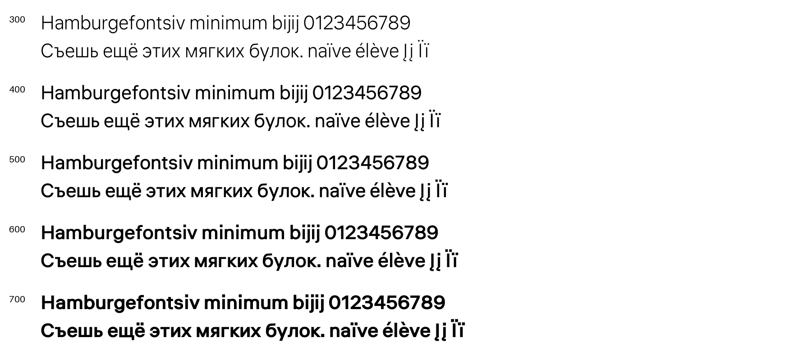

# Liter 

[![][Fontbakery]](https://skugiz.github.io/liter/fontbakery/fontbakery-report.html)
[![][Universal]](https://skugiz.github.io/liter/fontbakery/fontbakery-report.html)
[![][Outline Correctness]](https://skugiz.github.io/liter/fontbakery/fontbakery-report.html)
[![][Shaping]](https://skugiz.github.io/liter/fontbakery/fontbakery-report.html)

[Fontbakery]: https://img.shields.io/endpoint?url=https%3A%2F%2Fraw.githubusercontent.com%2Fskugiz%2Fliter%2Fgh-pages%2Fbadges%2Foverall.json
[Outline Correctness]: https://img.shields.io/endpoint?url=https%3A%2F%2Fraw.githubusercontent.com%2FFskugiz%2Fliter%2F%2Fgh-pages%2Fbadges%2FOutlineCorrectnessChecks.json
[Shaping]: https://img.shields.io/endpoint?url=https%3A%2F%2Fraw.githubusercontent.com%2Fskugiz%2Fliter%2Fgh-pages%2Fbadges%2FShapingChecks.json
[Universal]: https://img.shields.io/endpoint?url=https%3A%2F%2Fraw.githubusercontent.com%2Fskugiz%2Fliter%2Fgh-pages%2Fbadges%2FUniversal.json


Liter font is neo-grotesque in the spirit of the Swiss school of the new generation. At the beginning it was created for digital screens, and worked excellently in small font sizes 14-16. Designed to be a typesetting workhorse It has low contrast and little difference in height between uppercase and lowercase characters. Supports Cyrillic and Latin alphabet

## About

Liter, designed by [Anton Skugarov](https://skugarov.com) & Aleksander Ivanin


## Weight family

Liter includes five revised upright weights, plus a variable font:

| Weight | Style |
| --- | --- |
| 300 | Light |
| 400 | Regular |
| 500 | Medium |
| 600 | SemiBold |
| 700 | Bold |

- Desktop: `fonts/ttf/Liter-<Style>.ttf`
- Variable desktop: `fonts/variable/Liter[wght].ttf`
- Web: `fonts/webfonts/`, including `Liter[wght].woff2`
- Variable axis: `wght`, minimum **300**, default **400**, maximum **700**.

Light and Bold are rebuilt directly from Regular with separate corrections for
stems, dots, and accents. Version 1.101 replaces the initial 100–900 experiment;
Thin, ExtraLight, ExtraBold, and Black are retired from the shipped family.

**Design provenance:** the repository originally contained only a Regular master.
The added weights are an algorithmically derived extension, not previously
unreleased designer-authored weights. The original Regular source remains the
reference, with corrections to the missing dieresis in Ukrainian `Ї` and the
misplaced marks in `Ľ` and `ť`.
See [generation details and validation](documentation/WEIGHTS.md).



[Dots before and after](documentation/dot-comparison.png) ·
[Reading-size and accent proof](documentation/reading-sizes.png)

For the variable webfont:

```css
@font-face {
  font-family: "Liter";
  src: url("Liter[wght].woff2") format("woff2");
  font-weight: 300 700;
  font-style: normal;
  font-display: swap;
}

body { font-family: "Liter", sans-serif; font-weight: 400; }
h1 { font-weight: 650; }
```

Install either the static family or the variable font to avoid duplicate family
entries in desktop font menus.

## Building

Fonts are built automatically by GitHub Actions  take a look in the "Actions" tab for the latest build.

If you want to build fonts manually on your own computer:

* `make build` will produce font files.
* `make test` will run [FontBakery](https://github.com/googlefonts/fontbakery)'s quality assurance tests.
* `make proof` will generate HTML proofs, a PNG specimen, and complete glyph sheets.

Use Python 3.10 or later. Build and QA dependencies are pinned in the requirements
files. `make build` also writes editable Light, Regular, and Bold UFO masters and
`Liter.designspace` to `sources/generated/`. Generated sources can be recreated
from `sources/liter.glyphs` and `scripts/build-family.py`.

The proof files and QA tests are also available automatically via GitHub Actions - look at https://skugiz.github.io/liter.

## Changelog

**27 September 2026. Version 1.101**
- Rebuilt Light–Bold (300–700) directly from Regular and retired the four extreme weights.
- Corrected dot sizes, kept their centers stable, and maintained readable dieresis gaps.
- Applied consistent main-letter stroke changes and separate accent corrections.
- Added optical regression measurements and 16/24/48 px reading proofs.

**27 September 2026. Version 1.100 (superseded)**
- Added algorithmically derived weights 100–900 and a variable `wght` font.
- Added matching static and variable WOFF2 fonts, reproducible builds, and binary QA.
- Corrected Ukrainian uppercase Yi (`Ї`, U+0407), which lacked its dieresis.
- Corrected misplaced below-base marks in Lcaron (`Ľ`) and tcaron (`ť`).

**14 August 2023. Version 1.00**
- Updated character set to GF Latin Core


## License

This Font Software is licensed under the SIL Open Font License, Version 1.1.
This license is available with a FAQ at
https://scripts.sil.org/OFL

## Repository Layout

This font repository structure is inspired by [Unified Font Repository v0.3](https://github.com/unified-font-repository/Unified-Font-Repository), modified for the Google Fonts workflow.
